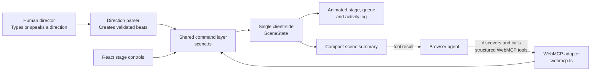

# StoryStage

**A shared animated stage for people and browser agents.**

StoryStage is an interactive storytelling app where a user types or speaks stage directions and watches characters act them out. In a WebMCP-capable browser, the user’s agent can co-direct the scene along side the user.

## Mission

Make storytelling feel like directing a tiny live theater. A person should be able to imagine a moment, say what happens, watch it take shape, and collaborate with AI agents.  Allow the audience to visualize the story together.

## Product thesis

StoryStage is **not** a general-purpose animated movie generator.

It is visualization tool and an **agent-native stage where a person and their browser agent co-direct a live scene**. The user and their agents see the characters, scenery, and action queue at all times and can interactively edit the action.

## Supported stage directions

The initial version intentionally supports a small animation vocabulary:

`enter` · `walk` · `run` · `point` · `talk` · `laugh` · `gasp` · `hide` · `exit` · `ride` · `hold` · `drop` · `shoot` · `fly` · `fall` · `attack`

StoryStage maps typed or spoken language to actions. This allows natural, playful direction while keeping animation reliable enough for a live, repeatable experience.  It also allows for a more interactive story telling. eg. reading a book and the little stage can now come to life while reading.


## Human–agent collaboration

The user creates a cast, selects scenery, places actors, and directs a scene. Their browser agent can co-direct it through WebMCP tools:

- `create_character`
- `create_scene`
- `place_actor`
- `direct_action`
- `set_expression`
- `play_scene`
- `get_scene_state`

These tools update the same client-side scene graph as the human interface. Agent actions are immediately visible and the user can redirect the scene at any time.
  # (TBD - refine this)



Human controls and agent tools share same state: both use the same validated command layer, then render the resulting `SceneState` in the shared visual stage.

## Why WebMCP

WebMCP lets StoryStage publish its client-side capabilities as discoverable tools for an in-browser and bridged agent(s). That gives the agent direct, dependable access to the stage without forcing it to guess at interface elements that may change or imitate clicks.

The result is a shared creative workflow: the agent helps direct, while the browser remains the common visual workspace for person and agent.

## Initial scope

The hackathon MVP focuses on a finished, demoable theater experience:

- A stage with a small set of character presets, scenery, and props.(this will be expandable by agents in future as well)
- Two ready-to-play scenes
- Lightweight character customizations
- Typed direction and browser speech-to-text (where supported)
- A visible (and manageable) action queue, character animation, dialogue bubbles, and simple stage effects.
- Working WebMCP tools that control the real scene.

## Long-term goals

The long-term goal is broader: an agent-native storytelling studio where people create characters and scenery from descriptions, animate richer performances, and build living story worlds together.

These capabilities are goals, **not the initial target**, because they cannot be delivered reliably within the hackathon time constraints:

- User submitted or AI-generated character art, scenery, props, and style packs
- Advanced rigging, lip sync, music, cameras, paralax, and cinematic transitions
- Open-ended animation (not the intentionally constrained action vocabulary)
- Persistent casts and worlds, branching stories, and reusable storyboards
- Multi-user sessions in which several people and agents co-direct together
- Agent planning that proposes sequences of story beats for creator approval

The MVP creates the foundation for that future: a shared scene graph, visual stage, and transparent WebMCP tool layer. It proves the key experience first—people and agents visibly creating a story side by side.

## Development

### Requirements

- Node.js 20.19+ (or Node 22+)
- A modern browser. Voice input and WebMCP are optional progressive enhancements.

### Run locally

```bash
npm install
npm run dev
```

Open the local URL printed by Vite. Build a production bundle with `npm run build`, then test it locally with `npm run preview`.

### Authenticated contest preview

StoryStage is configured for Cloudflare Workers Static Assets. The Worker in `worker.js` protects every production route with a browser-compatible sign-in page and a secure, one-day session cookie, while local Vite development remains unchanged. This avoids native HTTP Basic Auth dialogs (issues w/ not supported consistently by embedded browsers)

For CLI deployment, authenticate Wrangler locally, run `npm run build`, then run `npx wrangler deploy`. The included `wrangler.toml` configures the Worker entry point, SPA routing, and `dist` asset directory.

### Control from a Codex chat

StoryStage includes an opt-in local MCP bridge for agents that do not have direct browser WebMCP support. It is intentionally local-only: the bridge listens on `127.0.0.1:4175`, and the page must have **Agent Control** enabled before any agent command can affect the stage.

1. Copy `.env.example` to `.env`. Set `STORYSTAGE_ALLOWED_ORIGINS` to the comma-separated browser origins that may call the bridge. Add the deployed site origin when controlling a production deployment; do not use a wildcard.
2. Run the app with `npm run dev` and open it in your browser.
3. Add the bridge to Codex as a local STDIO MCP server. In Codex Desktop, choose **Settings → MCP servers → Add server**, choose **STDIO**, set the command to `node`, and set its argument to the absolute path of `server/agent-bridge.mjs`. Restart Codex after saving; Codex starts the bridge automatically.
4. In the page, turn on **Connect external harness**. Its status should become **External harness connected** once the bridge is running.
5. In the Codex chat, ask to connect to StoryStage and get the actions queue.

The bridge exposes the same agent-facing tools as WebMCP: `get_scene_state`, `create_scene`, `create_character`, `place_actor`, `direct_action`, `set_expression`, and `play_scene`. `npm run agent-bridge` is available only for local bridge diagnostics; do not run it separately when Codex is configured to launch the server. Keep the external harness connection off when you are not using it. If the page says **Browser agent-ready**, native WebMCP is already active and the local bridge is optional.

### Architecture

StoryStage keeps the entire scene in one client-side state model. The React controls, natural-language parser, playback engine, and WebMCP handlers all issue the same validated scene commands. No API key, backend, account, or database is required for the MVP.

The app also works in browsers without the experimental WebMCP API: the status badge changes to **Human direction mode**, while every human-facing stage control remains available.

### Deploy

The app is a static Vite site deployed with Cloudflare Workers Static Assets. Workers Builds uses:

- Build command: `npm run build`
- Deploy command: `npx wrangler deploy`
- Node version: 20.19+ or 22+

## Testing WebMCP

Test the deployed app in ChatGPT’s in-app browser, or use a compatible Chrome build with WebMCP testing enabled. Verify that an agent can discover each registered tool and that every tool visibly updates the stage. If the experimental browser API changes, the isolated `src/webmcp.ts` adapter is the only integration point that should need updating.
