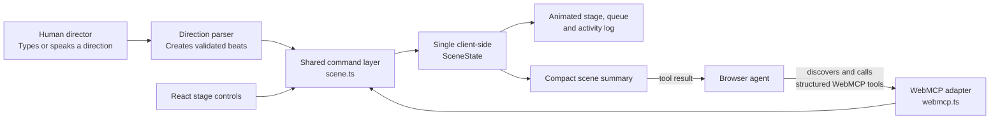

# StoryStage

**A shared animated stage for people and browser agents.**

StoryStage is a 2D interactive storytelling app where a user types or speaks stage directions and watches characters act them out. In a WebMCP-capable browser, the user’s agent can co-direct the exact same scene with structured tools.

## Mission

Make storytelling feel like directing a tiny live theater. A person should be able to imagine a moment, say what happens, watch it take shape, and collaborate with an AI agent without surrendering the visual world or their creative control.

## Product thesis

StoryStage is **not** a general-purpose animated movie generator.

It is an **agent-native stage where a person and their browser agent co-direct a live scene**. The user sees the characters, scenery, and action at all times; the agent uses clearly defined stage-direction tools to contribute inside that shared setting.

## Supported stage directions

The initial version intentionally supports a small animation vocabulary:

`enter` · `walk` · `run` · `point` · `talk` · `laugh` · `gasp` · `hide` · `exit` · `ride` · `hold` · `drop` · `shoot` · `fly` · `fall` · `attack`

StoryStage maps typed or spoken language to those actions. This allows natural, playful direction while keeping animation reliable enough for a live, repeatable experience.

Example: “Fenn enters from the left, walks to the lamp, points at the clue, and gasps.”

## Human–agent collaboration

The user creates a cast, selects scenery, places actors, and directs a scene. Their browser agent can co-direct it through WebMCP tools:

- `create_character`
- `create_scene`
- `place_actor`
- `direct_action`
- `set_expression`
- `play_scene`
- `get_scene_state`

These tools update the same client-side scene graph as the human interface. Agent actions are immediately visible and the user can redirect the scene at any time.

### How WebMCP connects to the stage



Human controls and agent tools never maintain separate state: both use the same validated command layer, then render the resulting `SceneState` in the shared visual stage.

## Why WebMCP

WebMCP lets StoryStage publish its client-side creative capabilities as structured, discoverable tools for an in-browser agent. That gives the agent direct, dependable access to the stage without forcing it to guess at interface elements or imitate clicks.

The result is a shared creative workflow: the agent helps direct, while the browser remains the common visual workspace for person and agent.

## Initial scope

The hackathon MVP focuses on a finished, demoable theater experience:

- A polished 2D stage with a small set of character presets, scenery, and props.
- Two ready-to-play scenes: the neon alley mystery and a static hillside knight quest with a castle, horse, sword, bow, and arrow.
- Lightweight character customization: names, palettes, and expressions.
- Typed direction and browser speech-to-text where supported.
- A visible action queue, character animation, dialogue bubbles, and simple stage effects.
- Working WebMCP tools that control the real scene.

## Long-term goals

The long-term goal is broader: an agent-native storytelling studio where people create characters and scenery from descriptions, animate richer performances, and build living story worlds together.

These capabilities are goals, **not the initial target**, because they cannot be delivered reliably within the hackathon time constraints:

- AI-generated character art, scenery, props, and style packs.
- Advanced rigging, lip sync, voice acting, music, cameras, and cinematic transitions.
- Open-ended animation beyond the intentionally constrained action vocabulary.
- Persistent casts and worlds, branching stories, and reusable storyboards.
- Multi-user sessions in which several people and agents co-direct together.
- Agent planning that proposes sequences of story beats for creator approval.

The MVP creates the foundation for that future: a shared scene graph, visual stage, and transparent WebMCP tool layer. It proves the key experience first—people and agents visibly creating a story side by side.

## Development

### Requirements

- Node.js 20.19+ (or Node 22+)
- A modern browser. Voice input and WebMCP are optional progressive enhancements.

### Run locally

```bash
npm install
npm run dev
```

Open the local URL printed by Vite. Build a production bundle with `npm run build`, then test it locally with `npm run preview`.

### Authenticated contest preview

StoryStage is configured for Cloudflare Workers Static Assets. The Worker in `worker.js` protects every production route with a browser-compatible sign-in page and a secure, one-day session cookie, while local Vite development remains unchanged. This avoids native HTTP Basic Auth dialogs, which are not supported consistently by embedded browsers.

1. In **Workers & Pages**, create an application, continue with GitHub, and select this repository.
2. Set the build command to `npm run build` and keep the deploy command as `npx wrangler deploy`.
3. Deploy once, then add encrypted runtime secrets named `BASIC_AUTH_USERNAME` and `BASIC_AUTH_PASSWORD` in **Settings → Variables and Secrets**. Do not commit their values.
4. Redeploy, open the HTTPS Workers URL in a private browser window, and verify that invalid credentials are rejected before sharing the URL and credentials with contest testers.

The Worker deliberately returns `503` when either credential is missing so a misconfigured preview cannot become public accidentally. The local MCP bridge must not be deployed; production WebMCP tools are registered directly by the page in a compatible browser.

For CLI deployment, authenticate Wrangler locally, run `npm run build`, then run `npx wrangler deploy`. The included `wrangler.toml` configures the Worker entry point, SPA routing, and `dist` asset directory.

### Control from a Codex chat

StoryStage includes an opt-in local MCP bridge for agents that do not have direct browser WebMCP support. It is intentionally local-only: the bridge listens on `127.0.0.1:4175`, and the page must have **Agent Control** enabled before any agent command can affect the stage.

1. Run the app with `npm run dev` and open it in your browser.
2. Add the bridge to Codex as a local STDIO MCP server. In Codex Desktop, choose **Settings → MCP servers → Add server**, choose **STDIO**, set the command to `node`, and set its argument to the absolute path of `server/agent-bridge.mjs`. Restart Codex after saving; Codex starts the bridge automatically.
3. In the page, turn on **Agent Control**. Its status should become **Connected** once the bridge is running.
4. In the Codex chat, ask: “Call `get_scene_state`, then queue Sir Arthur to hold the sword and play the scene.” The agent reads the live state first, sends atomic directions, and the visible browser scene carries them out.

The bridge exposes the same agent-facing tools as WebMCP: `get_scene_state`, `create_scene`, `create_character`, `place_actor`, `direct_action`, `set_expression`, and `play_scene`. `npm run agent-bridge` is available only for local bridge diagnostics; do not run it separately when Codex is configured to launch the server. Keep Agent Control off when you are not using it.

### Architecture

StoryStage keeps the entire scene in one client-side state model. The React controls, natural-language parser, playback engine, and WebMCP handlers all issue the same validated scene commands. No API key, backend, account, or database is required for the MVP.

The app also works in browsers without the experimental WebMCP API: the status badge changes to **Human direction mode**, while every human-facing stage control remains available.

### Deploy

The app is a static Vite site deployed with Cloudflare Workers Static Assets. Workers Builds uses:

- Build command: `npm run build`
- Deploy command: `npx wrangler deploy`
- Node version: 20.19+ or 22+

After deploying, add the public URL to [SUBMISSION_PROPOSAL.md](docs/SUBMISSION_PROPOSAL.md) before submitting.

## Testing WebMCP

Test the deployed app in ChatGPT’s in-app browser, or use a compatible Chrome build with WebMCP testing enabled. Verify that an agent can discover each registered tool and that every tool visibly updates the stage. If the experimental browser API changes, the isolated `src/webmcp.ts` adapter is the only integration point that should need updating.

## License

Add an OSI-approved license before publishing the repository.
